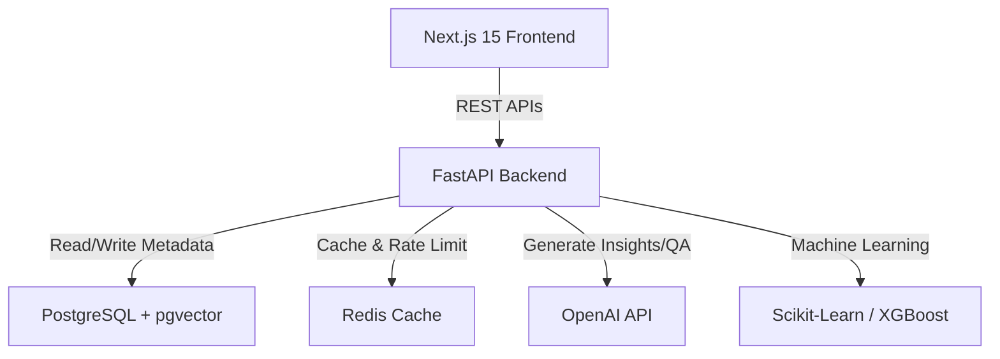

# InsightFlow AI

InsightFlow AI is an enterprise-grade, AI-powered Customer Analytics, Customer Intelligence, and Recommendation Platform. It empowers business users to upload datasets (CSV, Excel, JSON) and automatically clean, analyze, segment, predict churn/CLV, and ask questions of their data using natural language.

---

## System Architecture



## Folder Structure

*   `frontend/` - Next.js 15, TypeScript, Tailwind CSS, ShadCN UI, Recharts, React Query.
*   `backend/` - FastAPI, Python 3.12, Pandas, NumPy, Scikit-Learn, XGBoost, SQLAlchemy.
*   `docker/` - Deployment configurations and Nginx settings.
*   `database/` - DB initialization schemas and seed datasets.
*   `tests/` - Backend and frontend test files.

---

## Quick Start (Docker)

To run the entire platform with all dependencies locally using Docker:

1.  Ensure you have Docker and Docker Compose installed.
2.  Copy `.env.example` in both folders and set your parameters (e.g. OpenAI API Key).
3.  Run the compose command:
    ```bash
    docker-compose up --build
    ```
4.  Access the services:
    *   **Frontend Dashboard:** `http://localhost:3000`
    *   **FastAPI API Docs:** `http://localhost:8000/docs`

---

## Local Development Setup

### Backend (FastAPI)
1.  Navigate to `/backend`:
    ```bash
    cd backend
    ```
2.  Create and activate virtual environment:
    ```bash
    python -m venv venv
    venv\Scripts\activate
    ```
3.  Install dependencies:
    ```bash
    pip install -r requirements.txt
    ```
4.  Run server:
    ```bash
    python -m uvicorn app.main:app --reload --port 8000
    ```

### Frontend (Next.js)
1.  Navigate to `/frontend`:
    ```bash
    cd frontend
    ```
2.  Install packages:
    ```bash
    npm install
    ```
3.  Run dev server:
    ```bash
    npm run dev
    ```
